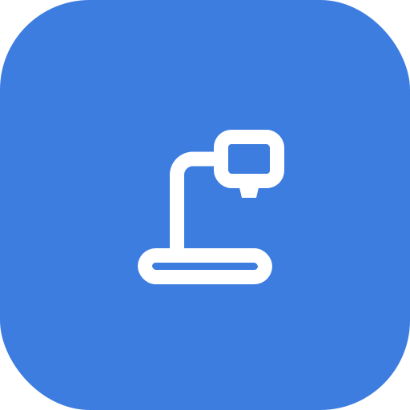

<div align="center">
  

  # DocCam — Document Camera

  **A simple document camera app — runs entirely in your browser.**

  [**▶ Live demo**](https://akichika.github.io/doc-camera/) · [日本語](#日本語)

</div>

---

DocCam turns any webcam (or a screen share) into a presentation document camera. Zoom in on a page, freeze a frame, point with a laser, dim everything but a spotlight, drop a ruler or grid on top, and grab a screenshot — all without installing anything and without sending a single frame to a server.

Everything happens locally in the browser using the `getUserMedia` / `getDisplayMedia` APIs. No backend, no build step — it's a single static `index.html`.

## Features

- 🎥 **Camera & screen share** — pick any connected camera or share a screen/window.
- 📷 **Dual camera** — when 2 or more cameras are connected, select a second camera for the split view; each camera remembers its own zoom, pan, and keystone state for the session.
- 🪟 **Dual view** — show camera + screen (or camera + camera) side-by-side (left/right or top/bottom) with a draggable divider, or as Picture-in-Picture with one-tap source swap.
- 🔍 **Zoom & pan** — slider, presets, **fit-width / fit-height**, double-tap / `0` to reset. Pan works in all modes including keystone correction.
- ⏸️ **Freeze & screenshot** — pause the live image and save a clean PNG.
- 🔄 **Rotate / mirror / keystone** — clockwise rotation, horizontal flip, and projector-style trapezoid (vertical/horizontal/angle) correction.
- 🔴 **Laser pointer** — 8 colors, 4 sizes, glowing fade-out trail; cursor preview dot visible even without clicking.
- 🖌️ **Highlighter pen** — persistent semi-transparent strokes in 6 colors, 3 widths and adjustable opacity; toggle button clears all strokes.
- 🔦 **Spotlight** — circle / ellipse / square / rectangle, adjustable size, darkness and softness.
- 📏 **Ruler** — pseudo-infinite ruler with solid / translucent / ticks-only styles, adjustable scale & angle, optional cross ruler with angle arc, draggable.
- ▦ **Grid** — halves, quarters, 3×3, 4×4, or a custom square grid (adjustable cell size); re-toggling restores the last-used grid type.
- 🎚️ **Image adjust** — brightness, contrast, saturation, white balance, and one-click **auto**.
- 💾 **Save settings** — save all current settings (zoom, keystone, grid, laser, ruler, layout, image adjustments, etc.) to the browser's local storage with the Save button; settings are restored on next load. Reset everything from the Settings panel.
- 🌗 **High-contrast mode** for accessibility.
- 🌐 **9 languages** (EN / 日本語 / 中文 / 한국어 / ES / FR / DE / PT / AR), auto-detected.
- 📲 **Installable PWA** — install directly from Chrome or Edge via the address bar install button.
- ⌨️ **Keyboard shortcuts** and tooltips throughout, with an auto-hiding UI.

## Keyboard shortcuts

| Key | Action | Key | Action |
| --- | --- | --- | --- |
| `Space` / `K` | Freeze | `L` | Laser pointer |
| `C` | Screenshot | `H` | Spotlight |
| `M` | Mirror | `U` | Ruler |
| `R` | Rotate | `G` | Grid |
| `T` | Keystone | `Y` | Highlighter pen |
| `Z` | Zoom panel | `Q` | Image adjust |
| `0` | Reset zoom | `V` | Layout |
| `+` / `-` | Zoom in / out | `X` | Swap sources |
| `F` | Fullscreen | `S` | Screen share |
| `P` | Picture-in-Picture | `Esc` | Exit tool / close panel |

## Usage

1. Open the [live demo](https://akichika.github.io/doc-camera/) (or run it locally — see below).
2. Click **Start**, then allow camera access (or choose **Screen share**).
3. Use the bottom toolbar for tools and the top bar for layout, PiP, fullscreen, high-contrast and settings.
4. Click **Save** (top-right, next to Settings) to persist your current settings across reloads.

> A secure context is required for camera access — i.e. `https://` or `localhost`. GitHub Pages serves over HTTPS, so the live demo works out of the box.

## Run locally

It's a static site, so any static file server works:

```bash
# from the project folder
npx serve -l 3000 .
# then open http://localhost:3000
```

## Privacy

DocCam has no server component. Camera and screen frames stay in your browser and are never uploaded. Screenshots are saved directly to your device via a normal download.

## Tech

- Single-file vanilla HTML / CSS / JavaScript — no framework, no build.
- HTML5 Canvas for laser, highlighter, spotlight, ruler and grid overlays.
- CSS transforms for zoom / pan / rotate / keystone; SVG `feColorMatrix` for white balance.
- `localStorage` for optional settings persistence.
- A minimal service worker + web manifest make it an installable PWA.

## License

[MIT](LICENSE) © akichika

---

<a name="日本語"></a>

## 日本語

**シンプルな書画カメラアプリ。インストール不要、ブラウザだけで完結します。**

[**▶ デモを開く**](https://akichika.github.io/doc-camera/)

Webカメラ（または画面共有）を書画カメラとして使えるアプリです。ズーム・静止・スクリーンショット保存に加え、レーザーポインター／蛍光ペン／スポットライト／ルーラー／グリッド／台形補正／画質調整などをブラウザ内だけで実行します。映像はサーバーに送信されず、すべて手元で処理されます（バックエンド無し・ビルド不要の単一 `index.html`）。

### 主な機能

- 🎥 カメラ選択・画面共有
- 📷 カメラが2台以上ある場合、カメラ2を分割表示に追加可能（ズーム・パン・台形補正などカメラごとに状態を維持）
- 🪟 カメラ＋画面（またはカメラ＋カメラ）の左右／上下分割（境界線ドラッグ可）、PinP（ソース入替）
- 🔍 ズーム／パン（スライダー・プリセット・縦/横フィット・リセット）、台形補正中もパン可能
- ⏸️ 静止・スクリーンショット（PNG）
- 🔄 90°回転・左右反転・台形補正（上下/左右/角度）
- 🔴 レーザーポインター（8色・4サイズ・発光トレイル、クリックしていないときもカーソルプレビュー表示）
- 🖌️ 蛍光ペン（6色・3サイズ・透明度調整・ONにするとすべてクリア）
- 🔦 スポットライト（円/楕円/正方形/長方形・サイズ・暗さ・ぼかし）
- 📏 ルーラー（擬似無限長・3スタイル・目盛り/角度・十字定規・交差角アーク・ドラッグ移動）
- ▦ グリッド（2分割/4/9/16分割・マス目サイズ可変・最後に使ったグリッドをトグルで復元）
- 🎚️ 画質調整（明るさ・コントラスト・彩度・ホワイトバランス・自動）
- 💾 設定保存（保存ボタンで全設定をブラウザのローカルストレージに保存、次回起動時に復元。設定ボタン内からすべてリセット可能）
- 🌗 ハイコントラストモード
- 🌐 9言語対応（自動判定）
- 📲 PWA対応（Chrome・Edgeのアドレスバーからインストール可能）

### キーボードショートカット

| キー | 機能 | キー | 機能 |
| --- | --- | --- | --- |
| `Space` / `K` | 静止 | `L` | レーザーポインター |
| `C` | スクリーンショット | `H` | スポットライト |
| `M` | 左右反転 | `U` | ルーラー |
| `R` | 回転 | `G` | グリッド |
| `T` | 台形補正 | `Y` | 蛍光ペン |
| `Z` | ズームパネル | `Q` | 画質調整 |
| `0` | ズームリセット | `V` | レイアウト |
| `+` / `-` | ズームイン/アウト | `X` | ソース入替 |
| `F` | 全画面 | `S` | 画面共有 |
| `P` | ピクチャーインピクチャー | `Esc` | ツール終了/パネルを閉じる |

### 使い方

1. [デモ](https://akichika.github.io/doc-camera/) を開く（またはローカル起動）。
2. **開始**を押してカメラを許可（または**画面共有**を選択）。
3. 下部ツールバーで各ツール、上部バーでレイアウト・PinP・全画面・ハイコントラスト・設定を操作。
4. 右上の**保存**ボタンで設定をブラウザに保存（次回起動時に自動復元）。

> カメラ利用には安全なコンテキスト（`https://` または `localhost`）が必要です。GitHub Pages はHTTPS配信のためそのまま動作します。

### ライセンス

[MIT](LICENSE) © akichika
